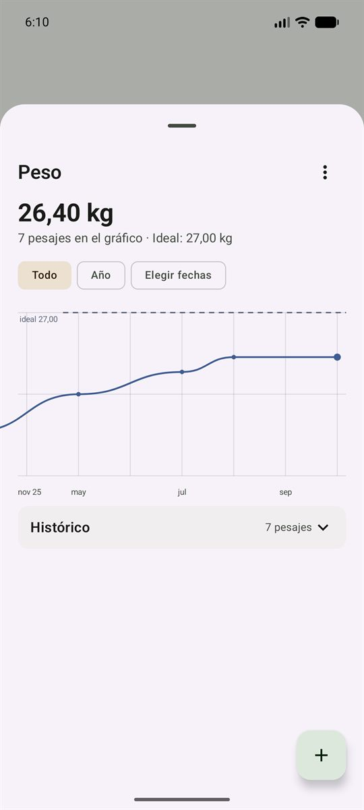
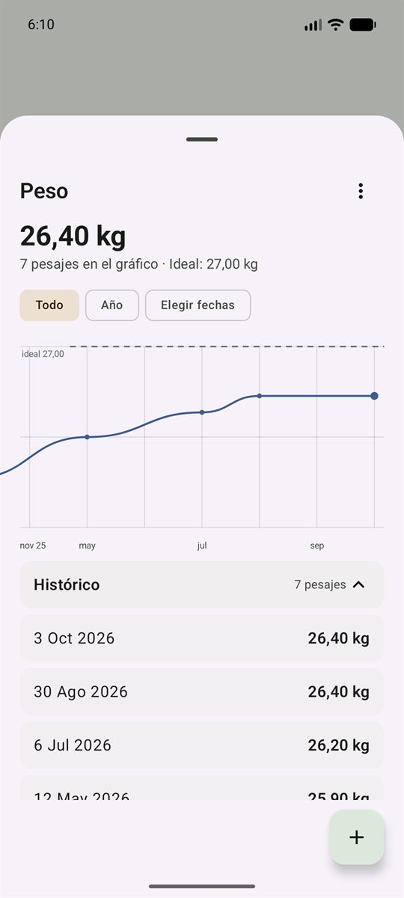
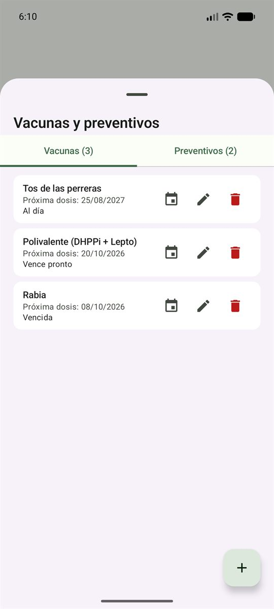
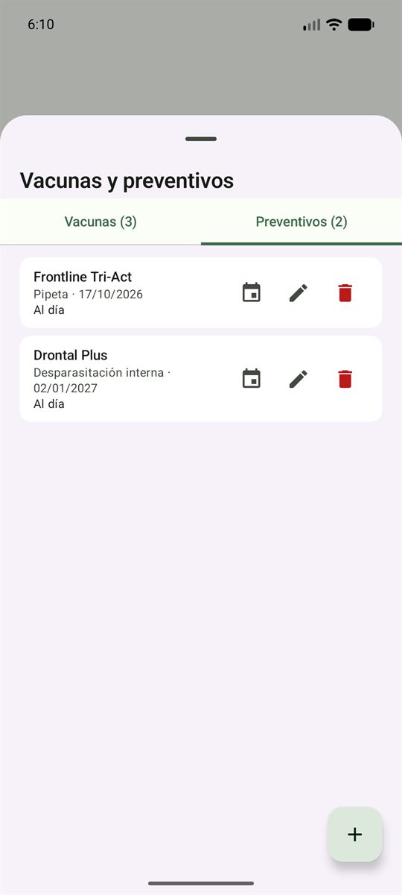
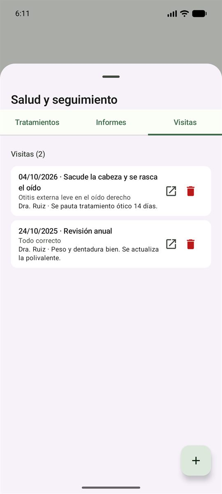
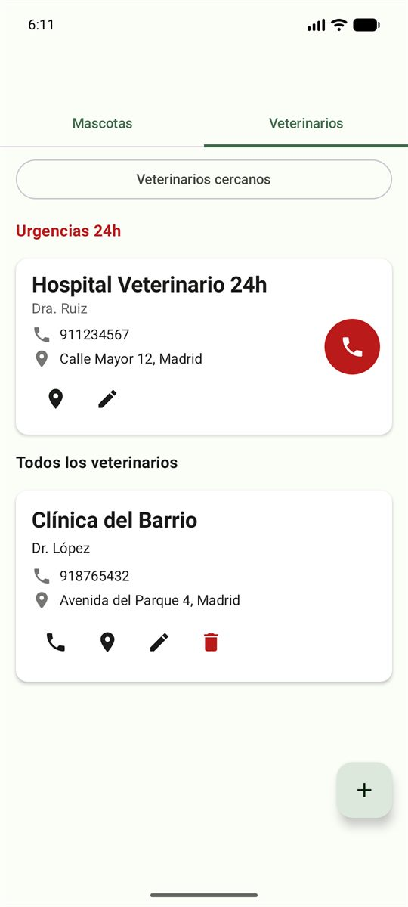

# 🐾 VirtualPetKMP

**VirtualPetKMP** es una aplicación multiplataforma (Android y Escritorio) para llevar un registro completo de la salud y los cuidados de tus mascotas: vacunas, desparasitaciones, peso, revisiones veterinarias, tratamientos e informes, todo en un solo lugar.

Desarrollada con **Kotlin Multiplatform** y **Compose Multiplatform**, compartiendo toda la lógica y la interfaz de usuario entre Android y escritorio. **El código es privado**; si estás interesado en él, puedes contactar con el autor.

---

## ✨ Características

- 🐶 **Gestión de mascotas**: fichas con datos básicos (nombre, especie, raza, fecha de nacimiento, sexo, color, microchip) y **peso ideal** opcional.
- 📷 **Foto de la mascota**: se puede elegir de los archivos o **hacer con la cámara** (Android); se ve en la ficha y en la lista de mascotas.
- 🏠 **Ficha como panel**: cabecera con la foto, el nombre y la edad, y tarjetas por bloque (peso, vacunas y preventivos, salud y seguimiento, notas) que muestran **un solo aviso** cada una: en ámbar lo que vence pronto y en rojo lo vencido. Las acciones de la mascota (modificar datos) van en un menú **⋮** en la propia cabecera.
- ⚖️ **Pesos**: registro y evolución en un **gráfico de línea arrastrable** en la ficha, y una vista detallada con el histórico mes a mes, filtros (todo, por año o por rango de fechas) y el **histórico plegable**: al pulsar un pesaje se abre un modal para editarlo o borrarlo.
- 🎯 **Peso ideal**: se puede fijar en la ficha de la mascota o desde la propia hoja de peso. Se dibuja como **línea discontinua** de referencia en el gráfico y, en la lista, el último peso lleva un indicador **▲ verde** si está por encima o **▼ rojo** si está por debajo.
- 💉 **Vacunas**: registro con próxima dosis, **notificaciones locales** 15 días antes y **añadir el recordatorio al calendario** del teléfono.
- 💊 **Preventivos**: pipetas, desparasitaciones y otros tratamientos preventivos, con aviso 5 días antes y también añadibles al calendario.
- 🩺 **Revisiones veterinarias**: historial con motivo, diagnóstico, notas y veterinario.
- 💊 **Tratamientos**: medicamentos con dosis, frecuencia y fechas, con los activos separados del historial.
- 📄 **Informes**: adjuntar informes veterinarios con tipo, descripción y archivo, y abrirlos desde la app.
- 📝 **Notas**: apuntes rápidos de interés sobre cada mascota.
- 🏥 **Veterinarios**: agenda con urgencias (botón directo de llamada), llamada normal y navegación con Google Maps.
- 📤 **Exportar ficha a PDF**: genera un PDF completo o resumido de la ficha de la mascota.
- 🔔 **Notificaciones locales**: para no olvidar las próximas dosis.
- 🌓 **Tema claro / oscuro**: se adapta a la configuración del sistema.
- 📱 **Multiplataforma**: misma experiencia en Android y Escritorio.
- 🔌 **Funciona sin conexión**: todos los datos viven en una base de datos SQLite local del dispositivo, con migraciones versionadas, así que nada depende de un servidor.

---

## 📸 Capturas

### Gestión de mascotas

| Lista de mascotas | Ficha de mascota | Nueva mascota |
|-------------------|------------------|---------------|
|  |  |  |

### Peso

| Evolución y peso ideal | Histórico |
|------------------------|-----------|
|  |  |

### Salud y cuidados

| Vacunas | Preventivos | Visitas y revisiones |
|---------|-------------|----------------------|
|  |  |  |

### Veterinarios

| Urgencias 24h y agenda |
|------------------------|
|  |

---

## 🛠️ Tecnologías

- **Kotlin Multiplatform** — código compartido entre Android y Desktop.
- **Compose Multiplatform** — UI compartida.
- **SQLDelight** — base de datos SQLite multiplataforma con migraciones versionadas.
- **Material 3** — sistema de diseño.
- **kotlinx-datetime** — manejo de fechas multiplataforma.
- **kotlinx-coroutines** — programación asíncrona.
- **AlarmManager + BroadcastReceiver** — notificaciones locales en Android.

---

## 📂 Estructura del proyecto

```
VirtualPetKMP/
├── androidApp/          # Módulo Android (Activity, manifest, recursos)
├── desktopApp/          # Módulo Desktop (main.kt, empaquetado)
├── shared/              # Código compartido KMP
│   ├── commonMain/      # Código común (UI, lógica, BD)
│   ├── androidMain/     # Implementaciones específicas de Android
│   ├── jvmMain/         # Implementaciones específicas de JVM/Desktop
│   └── sqldelight/      # Esquema y migraciones de la BD
└── build.gradle.kts
```

---

## 🚀 Cómo ejecutar el proyecto

**Requisitos previos:**
- JDK 11 o superior.
- Android Studio o IntelliJ IDEA con plugin de Kotlin.
- Android SDK (para la parte Android).

**App de Android:**
```bash
./gradlew :androidApp:assembleDebug
```

**App de Escritorio:**
```bash
./gradlew :desktopApp:run
```

Con **hot reload** durante el desarrollo:
```bash
./gradlew :desktopApp:hotRun --auto
```

---

## ✅ Tests

```bash
./gradlew :shared:jvmTest         # Tests de JVM
./gradlew :shared:allTests        # Todos los tests
```

---

## 🖼️ Capturas para la documentación

Las imágenes de este README se generan a partir de una base de datos de ejemplo, para que
muestren siempre el mismo aspecto (una vacuna vencida, una próxima, un tratamiento activo…):

```bash
# 1. Genera una base de datos con datos de ejemplo
./gradlew :shared:generarDatosEjemplo -PejemploSalida=C:/ruta/datos-ejemplo.db

# 2. Cópiala al dispositivo y abre la app
adb push datos-ejemplo.db /data/local/tmp/datos-ejemplo.db
adb shell "run-as com.example.virtualpetkmp sh -c 'cat /data/local/tmp/datos-ejemplo.db > /data/data/com.example.virtualpetkmp/databases/virtualpet.db'"
```

---

## 📌 Estado del proyecto

🚧 **En desarrollo activo.** Actualmente en fase beta con testers.

**Pendiente antes de la v1.0:**

- [ ] **Compartir el PDF de la ficha** en lugar de solo guardarlo: el botón de exportar debe
      ofrecer enviarlo por correo, WhatsApp, guardarlo en una carpeta, etc. Enfoque acordado:
      generar el PDF en la caché y lanzar el "compartir" del sistema (`ACTION_SEND` con
      `application/pdf`), que ya muestra esas opciones, en vez de construir un menú propio.
      Hace falta un `expect/actual` de compartir, como los que ya existen para llamar o abrir
      el mapa. Desbloquea también el punto de backup.
- [ ] **Cartilla veterinaria**: poder guardarla y consultarla dentro de la app, con fotos
      (una foto por página, reutilizando el selector de foto actual) o en PDF/imágenes.
      Requiere decidir antes: tabla nueva de páginas de cartilla (`mascotaId`, `ruta`,
      `fecha`, `nota`), su migración, y cómo mostrar un PDF dentro de la app (hoy los PDF se
      abren con una app externa).
- [ ] **Backup y paso de datos entre PC y móvil**: en una primera fase, exportar e importar
      la base de datos completa a un archivo (es un único fichero SQLite, así que es copiarlo;
      con el compartir del sistema ya se puede subir a Drive o enviarlo por correo). La
      sincronización automática entre dispositivos queda para más adelante: necesita backend
      o cuenta de Google y resolver conflictos.
- [ ] Publicación en Google Play Store.

---

## 📜 Licencia

**Todos los derechos reservados.** El código fuente de este proyecto es privado y no se permite su uso, copia, modificación ni distribución sin autorización expresa del autor.

Si estás interesado en el código, puedes contactar con el autor.

---

## 👤 Autor

**Enrique Robles** — [@eyemerald](https://github.com/eyemerald)

---

## 📚 Más información

- [Kotlin Multiplatform](https://www.jetbrains.com/help/kotlin-multiplatform-dev/get-started.html)
- [Compose Multiplatform](https://www.jetbrains.com/lp/compose-multiplatform/)
- [SQLDelight](https://sqldelight.github.io/sqldelight/)
