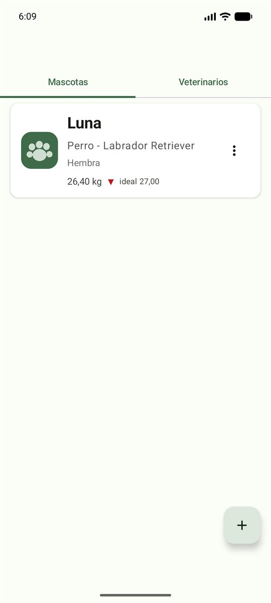
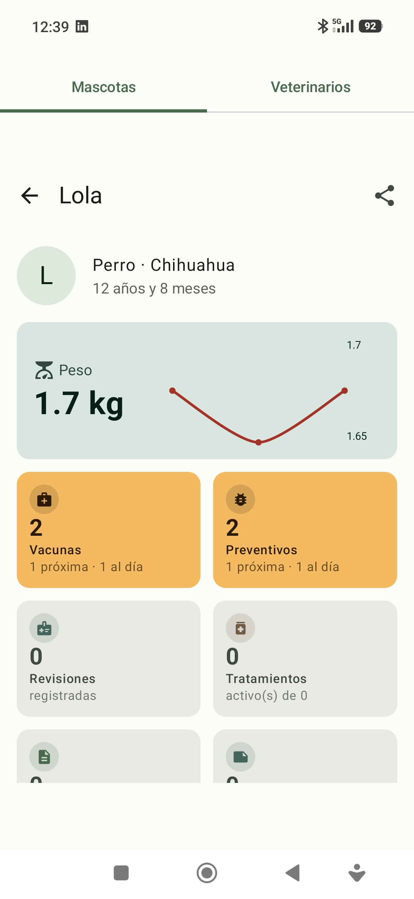
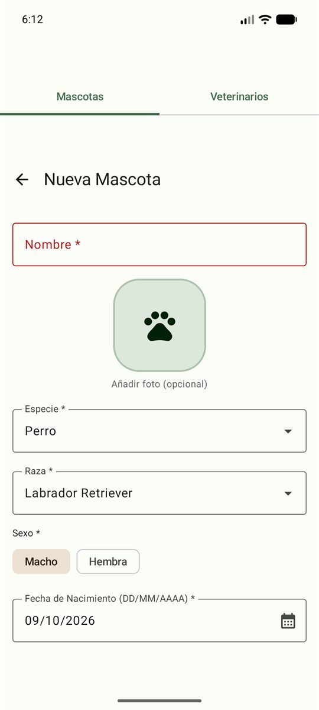
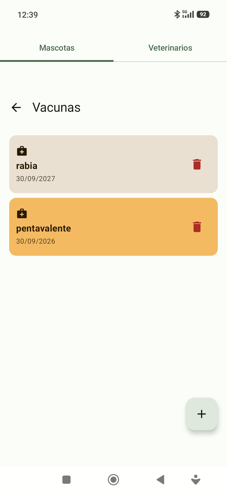
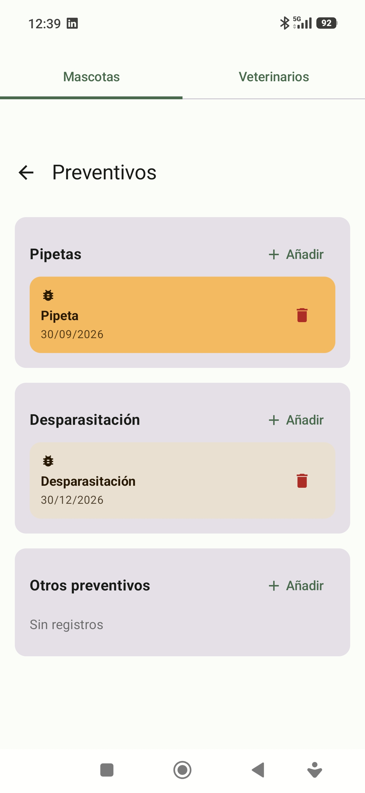
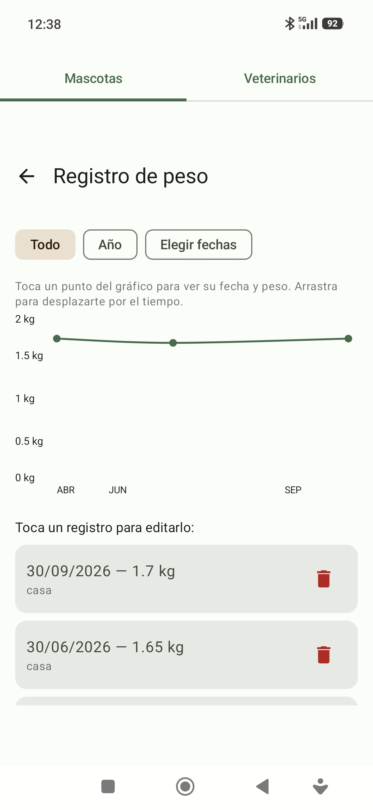
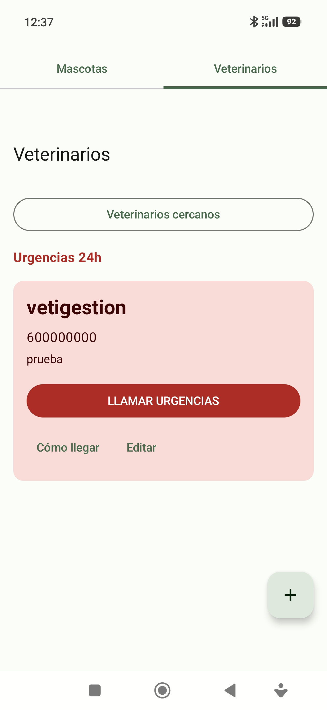
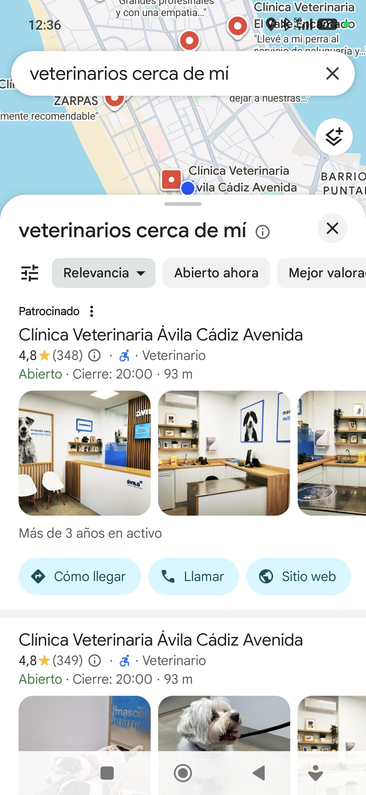

# 🐾 VirtualPetKMP

**VirtualPetKMP** es una aplicación multiplataforma (Android y Escritorio) para llevar un registro completo de la salud y los cuidados de tus mascotas: vacunas, desparasitaciones, pesos, revisiones veterinarias, tratamientos e informes, todo en un solo lugar.

Desarrollada con **Kotlin Multiplatform** y **Compose Multiplatform**, compartiendo toda la lógica y la interfaz de usuario entre Android y escritorio. **El código es privado**; si estás interesado en él, puedes contactar con el autor.

---

## ✨ Características

- 🐶 **Gestión de mascotas**: fichas con datos básicos (nombre, especie, raza, fecha de nacimiento, sexo, color, microchip).
- 📷 **Foto de la mascota**: se puede elegir de los archivos o **hacer con la cámara** (Android); aparece en un círculo grande y centrado en su ficha, con el nombre y la edad debajo.
- 💉 **Vacunas**: registro con próxima dosis y **notificaciones locales** 15 días antes.
- 💊 **Preventivos**: pipetas, desparasitaciones y otros tratamientos preventivos con aviso 1 día antes.
- ⚖️ **Pesos**: registro y evolución con **gráficos de línea suavizados**.
- 🩺 **Revisiones veterinarias**: historial con motivo, diagnóstico, notas y veterinario.
- 💊 **Tratamientos**: medicamentos con dosis, frecuencia y fechas.
- 📄 **Informes**: adjuntar informes veterinarios con tipo, descripción y archivo.
- 📝 **Notas**: apuntes rápidos de interés sobre cada mascota.
- 🏥 **Veterinarios**: agenda con urgencias, llamada directa y navegación con Google Maps.
- 📤 **Exportar ficha a PDF**: genera un PDF completo o resumido de la ficha de la mascota.
- 🔔 **Notificaciones locales**: para no olvidar las próximas dosis.
- 🌓 **Tema claro / oscuro**: se adapta a la configuración del sistema.
- 📱 **Multiplataforma**: misma experiencia en Android y Escritorio.

---

## 📸 Capturas

## 📸 Capturas

### Gestión de mascotas

| Lista de mascotas | Ficha de mascota | Nueva mascota |
|-------------------|------------------|---------------|
|  |  |  |

### Salud y cuidados

| Vacunas | Preventivos | Evolución del peso |
|---------|-------------|-------------------|
|  |  |  |

### Veterinarios

| Urgencias 24h | Veterinarios cercanos |
|---------------|----------------------|
|  |  |

---

## 🛠️ Tecnologías

- **Kotlin Multiplatform** — código compartido entre Android y Desktop.
- **Compose Multiplatform** — UI compartida.
- **SQLDelight** — base de datos SQLite multiplataforma con migraciones versionadas.
- **Material 3** — sistema de diseño.
- **kotlinx-datetime** — manejo de fechas multiplataforma.
- **kotlinx-coroutines** — programación asíncrona.
- **AlarmManager + BroadcastReceiver** — notificaciones locales en Android.

---

## 📂 Estructura del proyecto

```
VirtualPetKMP/
├── androidApp/          # Módulo Android (Activity, manifest, recursos)
├── desktopApp/          # Módulo Desktop (main.kt, empaquetado)
├── shared/              # Código compartido KMP
│   ├── commonMain/      # Código común (UI, lógica, BD)
│   ├── androidMain/     # Implementaciones específicas de Android
│   ├── jvmMain/         # Implementaciones específicas de JVM/Desktop
│   └── sqldelight/      # Esquema y migraciones de la BD
└── build.gradle.kts
```

---

## 🚀 Cómo ejecutar el proyecto

**Requisitos previos:**
- JDK 11 o superior.
- Android Studio o IntelliJ IDEA con plugin de Kotlin.
- Android SDK (para la parte Android).

**App de Android:**
```bash
./gradlew :androidApp:assembleDebug
```

**App de Escritorio:**
```bash
./gradlew :desktopApp:run
```

Con **hot reload** durante el desarrollo:
```bash
./gradlew :desktopApp:hotRun --auto
```

---

## ✅ Tests

```bash
./gradlew :shared:jvmTest         # Tests de JVM
./gradlew :shared:allTests        # Todos los tests
```

---

## 📌 Estado del proyecto

🚧 **En desarrollo activo.** Actualmente en fase beta con testers.

**Pendiente antes de la v1.0:**

- [ ] Botón "Añadir al calendario" en vacunas y preventivos.
- [ ] Backup / Exportar / Importar datos.
- [ ] Compartir PDF directamente.
- [ ] Publicación en Google Play Store.

---

## 📜 Licencia

**Todos los derechos reservados.** El código fuente de este proyecto es privado y no se permite su uso, copia, modificación ni distribución sin autorización expresa del autor.

Si estás interesado en el código, puedes contactar con el autor.

---

## 👤 Autor

**Enrique Robles** — [@eyemerald](https://github.com/eyemerald)

---

## 📚 Más información

- [Kotlin Multiplatform](https://www.jetbrains.com/help/kotlin-multiplatform-dev/get-started.html)
- [Compose Multiplatform](https://www.jetbrains.com/lp/compose-multiplatform/)
- [SQLDelight](https://sqldelight.github.io/sqldelight/)